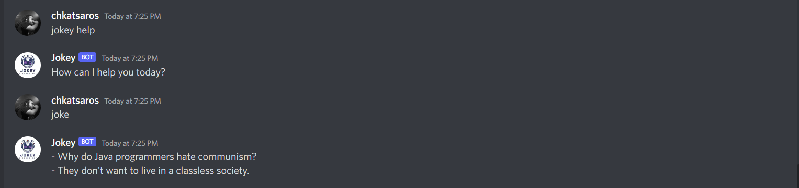

<div id="top" align="center">

  [![Contributors][contributors-shield]][contributors-url]
  [![Forks][forks-shield]][forks-url]
  [![Stargazers][stars-shield]][stars-url]
  [![Issues][issues-shield]][issues-url]
  [![MIT License][license-shield]][license-url]
  <!-- [![LinkedIn][linkedin-shield]][linkedin-url] -->

 </div>

<!-- PROJECT LOGO -->
<br />
<div align="center">
  <a href="https://github.com/chkatsaros/jokey-discord-bot/">
    
  </a>

   ### jokey-discord-bot</font>

  <p align="center">
    :robot: <strong>Jokey</strong> is a joke bot to integrate to your discord servers :robot:
    <br />
    <a href="https://github.com/chkatsaros/jokey-discord-bot"><strong>Explore the docs »</strong></a>
    <br />
    <br />
    <a href="https://discord.com/oauth2/authorize?client_id=1003384862947946538&scope=bot">
        
    </a>
    <br />
    <br />
    <a href="https://github.com/chkatsaros/jokey-discord-bot/issues">Request Feature</a>
    ·
    <a href="https://github.com/chkatsaros/jokey-discord-bot/issues">Report Bug</a>
    ·
    <a href="https://discord.com/oauth2/authorize?client_id=1003384862947946538&scope=bot">Add to your server</a>
  </p>
</div>

<!-- TABLE OF CONTENTS -->
<details>
  <summary>Table of Contents</summary>
  <ol>
    <li>
      <a href="#about-the-project">About The Project</a>
      <ul>
        <li><a href="#built-with">Built With</a></li>
      </ul>
    </li>
    <li>
      <a href="#getting-started">Getting Started</a>
      <ul>
        <li><a href="#prerequisites">Prerequisites</a></li>
        <li><a href="#installation">Installation</a></li>
      </ul>
    </li>
<!--     <li><a href="#usage">Usage</a></li> -->
    <li><a href="#roadmap">Roadmap</a></li>
    <li><a href="#contributing">Contributing</a></li>
    <li><a href="#license">License</a></li>
    <li><a href="#contact">Contact</a></li>
    <li><a href="#acknowledgments">Acknowledgments</a></li>
  </ol>
</details>

<!-- ABOUT THE PROJECT -->

## About The Project

<div align="center">
  <a href="https://github.com/chkatsaros/jokey-discord-bot/">
    
  </a>
</div>
<br/>
<!-- [![Product Name Screen Shot][product-screenshot]](https://example.com) -->

<p align="right">(<a href="#top">back to top</a>)</p>

### Built With

- [![Go][golang]][golang-url]
- [![JokeAPI][jokeapi]][jokeapi-url]
<!-- - [![Next][next.js]][next-url]
- [![React][react.js]][react-url]
- [![Vue][vue.js]][vue-url]
- [![Angular][angular.io]][angular-url]
- [![Svelte][svelte.dev]][svelte-url]
- [![Laravel][laravel.com]][laravel-url]
- [![Bootstrap][bootstrap.com]][bootstrap-url]
- [![JQuery][jquery.com]][jquery-url] -->

<p align="right">(<a href="#top">back to top</a>)</p>

<!-- GETTING STARTED -->

## Getting Started

<!-- This is an example of how you may give instructions on setting up your project locally. -->
To get a local copy up and running follow these simple example steps.

### Prerequisites

<!-- This is an example of how to list things you need to use the software and how to install them.

- npm
  ```sh
  npm install npm@latest -g
  ``` -->

### Installation

<!-- 1. Get a free API Key at [https://example.com](https://example.com)
2. Clone the repo
   ```sh
   git clone https://github.com/chkatsaros/jokey-discord-bot.git
   ```
3. Install NPM packages
   ```sh
   npm install
   ```
4. Enter your API in `config.js`
   ```js
   const API_KEY = "ENTER YOUR API";
   ``` -->

<p align="right">(<a href="#top">back to top</a>)</p>

<!-- USAGE EXAMPLES -->

<!-- ## Usage

Use this space to show useful examples of how a project can be used. Additional screenshots, code examples and demos work well in this space. You may also link to more resources.

_For more examples, please refer to the [Documentation](https://example.com)_

<p align="right">(<a href="#top">back to top</a>)</p> -->

<!-- ROADMAP -->

## Roadmap

- [ ] Add commands for particular joke types
- [ ] Update [__jokey help__](https://github.com/chkatsaros/jokey-discord-bot/blob/master/bot/bot.go#L60) command
- [ ] Migrate to interaction
- [ ] Add database of blacklisted jokes
- [ ] Add __report__ and __next joke__ interactions  

See the [open issues](https://github.com/chkatsaros/jokey-discord-bot/issues) for a full list of proposed features (and known issues) and feel free to request a new feature or functionality.

<p align="right">(<a href="#top">back to top</a>)</p>

<!-- CONTRIBUTING -->

## Contributing

Contributions are what make the open source community such an amazing place to learn, inspire, and create. Any contributions you make are **greatly appreciated**.

If you have a suggestion that would make this better, please fork the repo and create a pull request. You can also simply open an issue with the tag "enhancement".
Don't forget to give the project a star! Thanks again!

1. Fork the Project
2. Create your Feature Branch (`git checkout -b feat/amazing_feature`)
3. Commit your Changes (`git commit -m 'Add some AmazingFeature'`)
4. Push to the Branch (`git push origin feat/amazing_feature`)
5. Open a Pull Request

<p align="right">(<a href="#top">back to top</a>)</p>

<!-- LICENSE -->

## License

Distributed under the MIT License. See the `LICENSE` [here](https://github.com/chkatsaros/jokey-discord-bot/blob/master/LICENSE) for more information.

<p align="right">(<a href="#top">back to top</a>)</p>

<!-- CONTACT -->

## Contact

Christos Katsaros - [chkatsaros.com](https://www.chkatsaros.com) - chris.d.katsaros@gmail.com

Project Link: [https://github.com/chkatsaros/jokey-discord-bot](https://github.com/chkatsaros/jokey-discord-bot)

<p align="right">(<a href="#top">back to top</a>)</p>

<!-- ACKNOWLEDGMENTS -->

## Acknowledgments

- [DiscordGo](https://github.com/bwmarrin/discordgo)
- [Discord Bot in Golang](https://github.com/Rahulkumar2002/discord-bot-golang?ref=golangexample.com)
- [JokeAPI](https://jokeapi.dev/)

<p align="right">(<a href="#top">back to top</a>)</p>

<!-- MARKDOWN LINKS & IMAGES -->
<!-- https://www.markdownguide.org/basic-syntax/#reference-style-links -->

[contributors-shield]: https://img.shields.io/github/contributors/chkatsaros/jokey-discord-bot.svg?style=for-the-badge
[contributors-url]: https://github.com/chkatsaros/jokey-discord-bot/graphs/contributors
[forks-shield]: https://img.shields.io/github/forks/chkatsaros/jokey-discord-bot.svg?style=for-the-badge
[forks-url]: https://github.com/chkatsaros/jokey-discord-bot/network/members
[stars-shield]: https://img.shields.io/github/stars/chkatsaros/jokey-discord-bot.svg?style=for-the-badge&color=ffac33
[stars-url]: https://github.com/chkatsaros/jokey-discord-bot/stargazers
[issues-shield]: https://img.shields.io/github/issues/chkatsaros/jokey-discord-bot.svg?style=for-the-badge
[issues-url]: https://github.com/chkatsaros/jokey-discord-bot/issues
[license-shield]: https://img.shields.io/github/license/chkatsaros/jokey-discord-bot.svg?style=for-the-badge
[license-url]: https://github.com/chkatsaros/jokey-discord-bot/blob/master/LICENSE
[linkedin-shield]: https://img.shields.io/badge/-LinkedIn-black.svg?style=for-the-badge&logo=linkedin&colorB=555
[linkedin-url]: https://linkedin.com/in/chkatsaros
[product-screenshot]: images/screenshot.png
[next.js]: https://img.shields.io/badge/next.js-000000?style=for-the-badge&logo=nextdotjs&logoColor=white
[next-url]: https://nextjs.org/
[react.js]: https://img.shields.io/badge/React-20232A?style=for-the-badge&logo=react&logoColor=61DAFB
[react-url]: https://reactjs.org/
[vue.js]: https://img.shields.io/badge/Vue.js-35495E?style=for-the-badge&logo=vuedotjs&logoColor=4FC08D
[vue-url]: https://vuejs.org/
[angular.io]: https://img.shields.io/badge/Angular-DD0031?style=for-the-badge&logo=angular&logoColor=white
[angular-url]: https://angular.io/
[svelte.dev]: https://img.shields.io/badge/Svelte-4A4A55?style=for-the-badge&logo=svelte&logoColor=FF3E00
[svelte-url]: https://svelte.dev/
[laravel.com]: https://img.shields.io/badge/Laravel-FF2D20?style=for-the-badge&logo=laravel&logoColor=white
[laravel-url]: https://laravel.com
[bootstrap.com]: https://img.shields.io/badge/Bootstrap-563D7C?style=for-the-badge&logo=bootstrap&logoColor=white
[bootstrap-url]: https://getbootstrap.com
[jquery.com]: https://img.shields.io/badge/jQuery-0769AD?style=for-the-badge&logo=jquery&logoColor=white
[jquery-url]: https://jquery.com
[golang]: https://img.shields.io/badge/GO-29BEB0?style=for-the-badge&logo=go&logoColor=white
[golang-url]: https://go.dev/
[jokeapi]: https://img.shields.io/badge/jokeapi-3f188f?style=for-the-badge
[jokeapi-url]: https://github.com/Sv443/JokeAPI
